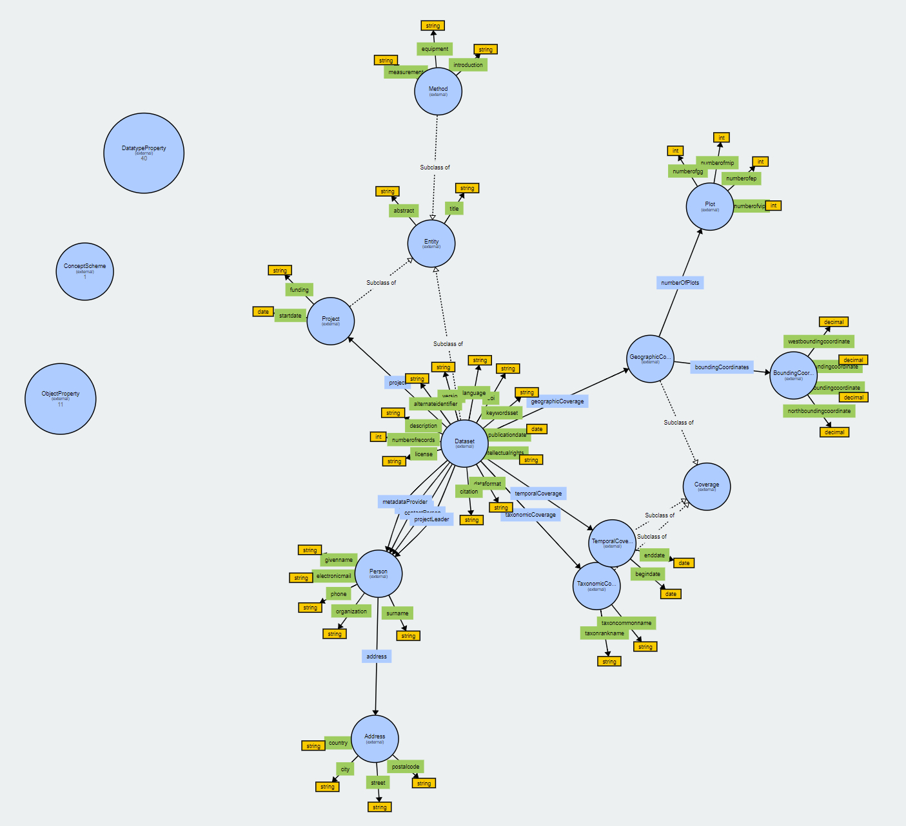

# Make Schema [](https://zenodo.org/badge/latestdoi/520071334)


Make Schema is a python tool that is based on [rdflib](https://github.com/RDFLib/rdflib) to create an RDF schema aka ontology.
This tool is developed and tested in the scope of [Meta2KG](https://github.com/fusion-jena/Meta2KG) project to create the BMO ontology. 

The target ontology, BMO in this repo, would contain:
1. RDFS classes and subclasses
2. Data and Object properties 
3. Vocab reusability via `SKOS:exactMatch` and `SKOS:closeMatch` currently we support reusability from [Dublin Core](https://www.dublincore.org/), [schema.org](https://schema.org/), and [Wikidata](https://www.wikidata.org/wiki/Wikidata:Main_Page)

## Generated Ontology (BMO) [](https://doi.org/10.5281/zenodo.6948519)
The generated ontology given the current definitions is as follows. 
The visualization is created by the public service of [webvowl](http://vowl.visualdataweb.org/webvowl.html)


## To Build Your Own Ontology

### Basic Changes
This involves changing the data aka. definitions only
1. Under [/utils](/utils):
   * you need to change the [definitions.py](/utils/definitions.py) to meet your ontology.
   * If you need to reuse vocab from sources other than what is supported, you need to change that under [namespaces.py](utils\namespaces.py) as well
2. Make sure that you have the correct metadata that well described your schema by changes [meta_config.py](meta_config.py) 
3. After you change the corresponding files, run [create.py](create.py) 

### Advanced 
Besides the 'Basic Changes' above, if you need to support more to generate of your ontology, then you would need to change both [data_structure.py](utils/data_structure.py) and [create.py](create.py).
- The first one would be the placeholder for the new attribute e.g., RDFS.type (is_a relationships). 
- The second one would be the place where you fetch the new attribute and transform it into an knowledge graph triple. 

### Citation

Please use the following citation if you like to use the code
```
@software{nora_abdelmageed_2022_6948513,
  author       = {Nora Abdelmageed},
  title        = {fusion-jena/MakeSchema: BMO\_code},
  month        = aug,
  year         = 2022,
  publisher    = {Zenodo},
  version      = {v1.0.0},
  doi          = {10.5281/zenodo.6948513},
  url          = {https://doi.org/10.5281/zenodo.6948513}
}
```
